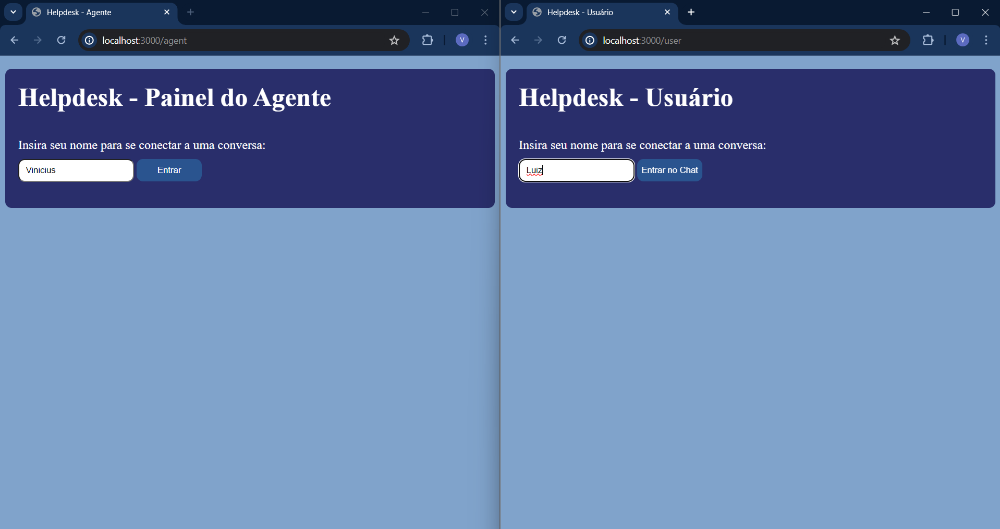
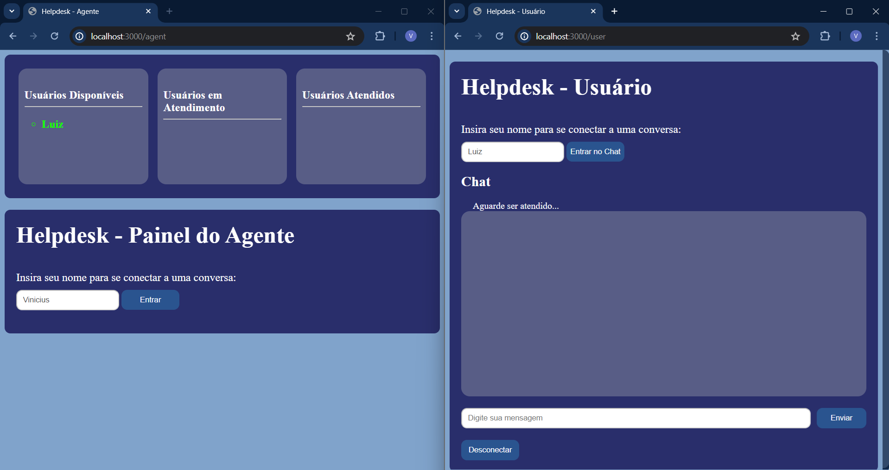
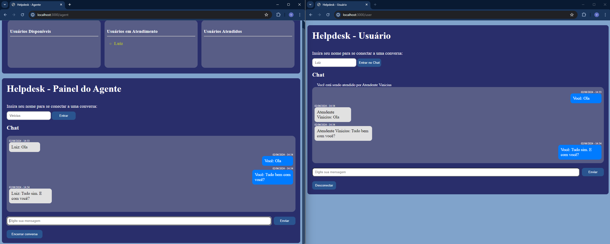
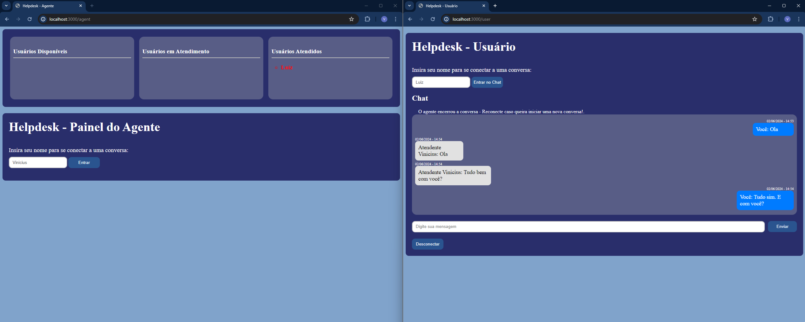

# Descrição Detalhada do Código user.html

## Cabeçalho (head):

1. Importa as bibliotecas socket.io e jQuery necessárias para a funcionalidade do chat.
2. Importa o arquivo CSS (user.css) para estilização da página.

## Corpo (body):

1. Contém a estrutura HTML para o formulário de login e a interface de chat.
2. #secao_form: Seção principal que contém o formulário de login e o contêiner do chat.
3. #form: Formulário de login que solicita o nome do usuário.
4. #chat-container: Contêiner do chat que fica oculto inicialmente e é exibido após o login.

## JavaScript (script):

1. Envolve todo o código dentro de $(function() {}), que é executado quando o DOM está completamente carregado.
2. Inicializa o socket.io e uma variável currentUser para armazenar o nome do usuário.

### Função scrollToBottom:

1. Função auxiliar que rola a conversa até o fim para sempre mostrar a mensagem mais recente.

### Evento de Submissão do Formulário de Login:

1. Captura o evento de submissão do formulário de login.
2. Envia o nome do usuário ao servidor via socket.emit.
3. Desabilita o campo de entrada de nome e o botão de login, e exibe o contêiner do chat.

### Evento de Clique no Botão de Desconectar:

1. Envia um evento de desconexão ao servidor.
2. Esconde o contêiner do chat e desabilita o formulário de chat.

### Evento de Identificação do Agente:

1. Recebe o nome do agente do servidor e atualiza o status.
2. Habilita o formulário de chat para permitir o envio de mensagens.

### Função geraData:

1. Gera uma string com a data e hora atuais formatadas.

### Evento de Recebimento de Mensagem:

1. Recebe mensagens do servidor e adiciona à conversa.
2. Exibe a mensagem recebida com a data e hora.

### Evento de Submissão do Formulário de Chat:

1. Captura o evento de submissão do formulário de chat.
2. Envia a mensagem ao servidor e adiciona à conversa localmente.
3. Limpa o campo de entrada de mensagem.

### Evento de Desconexão do Usuário:

1. Atualiza o status e desabilita o formulário de chat quando o agente encerra a conversa.

---
---

# Descrição Detalhada do Código agent.html

## Cabeçalho (head):

1. Importa as bibliotecas socket.io e jQuery necessárias para a funcionalidade do chat.
2. Importa o arquivo CSS (agent.css) para estilização da página.

## Corpo (body):

1. Contém a estrutura HTML para a lista de usuários e a interface de chat.
2. section.secao_listas: Seção contendo três listas para exibir usuários disponíveis, em atendimento e atendidos.
3. section#secao_form: Seção principal que contém o formulário de login e o contêiner do chat.

## JavaScript (script):

1. Envolve todo o código dentro de $(function() {}), que é executado quando o DOM está completamente carregado.
2. Inicializa o socket.io e variáveis para armazenar o nome do agente e o usuário selecionado.

### Função scrollToBottom:

1. Função auxiliar que rola a conversa até o fim.

### Evento de submissão do formulário de login:

1. Previne o comportamento padrão do formulário.
2. Obtém o nome do agente e envia ao servidor com socket.emit('agent login', agentName).
3. Desabilita os campos de entrada e botão de login após a submissão.

### Eventos de atualização de usuários:

1. Atualiza as listas de usuários (available-users, active-users, attended-users) com base nos dados recebidos do servidor.

### Eventos de seleção de usuário:

1. Permite ao agente selecionar um usuário para iniciar ou continuar uma conversa.
2. Envia o evento agent select conversation ao servidor.

### Função geraData:

1. Gera uma string formatada com a data e hora atuais.

### Evento de recebimento de mensagem:

1. Adiciona a mensagem recebida ao contêiner de conversa (#conversation).

### Evento de submissão do formulário de mensagem:

1. Previne o comportamento padrão do formulário.
2. Obtém a mensagem, envia ao servidor com socket.emit('agent message'), e adiciona a mensagem enviada ao contêiner de conversa.

### Evento de clique no botão de desconectar:

1. Envia o evento agent disconnect ao servidor.
2. Esconde o contêiner de chat e mostra novamente a lista de usuários disponíveis.

### Eventos adicionais:

1. agent conversation selected: Atualiza a interface quando uma conversa é selecionada pelo agente.
2. agent conversation ended: Atualiza a interface quando uma conversa é encerrada.
3. user attended: Adiciona o usuário à lista de usuários atendidos.

---
---

# Descrição Detalhada do Código server.js

### Importação dos Módulos:

- Importa os módulos express, http, socket.io e path.

### Configuração do Servidor e do Socket.IO:

- Cria uma aplicação Express, um servidor HTTP e uma instância do Socket.IO.

### Variáveis Globais:

- Inicializa objetos para armazenar usuários, agentes e conversas ativas.

### Servir Arquivos Estáticos:

- Configura a pasta de arquivos estáticos para servir CSS.

### Roteamento das Páginas HTML:

- Define rotas para as páginas HTML do agente, usuário e a página inicial.

### Conexão do Socket.IO:

- Configura o evento de conexão do Socket.IO e define os eventos de socket dentro do bloco de conexão.

### Login do Usuário:

- Armazena o usuário conectado e atualiza a lista de usuários e conversas ativas.

### Login do Agente:

- Armazena o agente conectado e atualiza a lista de agentes.

### Seleção de Conversa pelo Agente:

- Gerencia a seleção de conversa pelo agente, atualiza o estado da conversa e notifica as partes envolvidas.

### Desconexão do Socket:

- Lida com a desconexão do socket, removendo o usuário ou agente da lista e atualizando os clientes conectados.

### Mensagens do Agente:

- Envia mensagens do agente para o usuário correspondente.

### Mensagens do Usuário:

- Envia mensagens do usuário para o agente correspondente.

### Desconexão do Agente:

- Gerencia a desconexão do agente e atualiza o estado da conversa e dos usuários.

### Desconexão do Usuário:

- Gerencia a desconexão do usuário e atualiza o estado da conversa e dos agentes.

### Início do Servidor:

- Inicia o servidor na porta 3000.

---
---
# Como rodar este projeto
```bash
# Clone este repositorio
$ git clone https://github.com/galvao22/helpdesk_socket_io.git

# Instale as dependencias
$ npm install

# Execute a aplicaçao
$ yarn dev
```

# Imagens do projeto

## Tela de inicio do agente e do usuário


- Tanto o agente quando o usuário prrenchem o formulário com seus nomes para iniciarem o chat.

## Tela de lista de usuários para o agente e tela de chat do usuário


- Na tela do agente, na primeira lista, o mesmo seleciona um usuário para iniciar uma conversa. Que após selecionado muda para segunda lista, e após atendido muda para terceira lista.

- Na tela do usuário, o chat ja se encontra aberto aguardando que algum agente se conecte a ele para iniciar uma conversa.

## Tela do chat do agente e do usuário


- Após a seleção do usuário pelo agente, ambos podem conversar em tempo real.

## Tela após encerramento da conversa


- Para o agente o chat fecha e o usuário é movido para terceira lista até que deslogue no sistema.
- Para o usuário, todas as funcionalidades ficam bloqueadas, até que o mesmo reinicie a página e realize outro login.